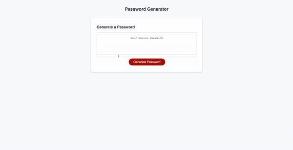

# Kavya's Random Password Generator

## JavaScript - Week 3 Challenge

## Table of Contents

- [Description](#description)
- [Languages](#languages)
- [Deployed Link](#link)
- [Installation](#installation)
- [Usage](#usage)
- [Credits](#credits)
- [License](#license)

## Description

User can generate a random password based on a set of requirements/prompts. Choose the number of characters you'd like your random password to have. A series of yes/no style questions will be asked to see if you'd like to include certain character types. Atleast one character type should be selected. Once the series of prompts have been completed, generated password should be returned to the user.

## Languages

- HTML
- CSS
- JavaScript

## Deployed Link

[Link](https://smandla.github.io/random_password_generator/)

## Usage

### Website Demo

## Credits

Credits to University of California, Berkeley.

## License

---

© 2022 Trilogy Education Services, LLC, a 2U, Inc. brand. Confidential and Proprietary. All Rights Reserved.
